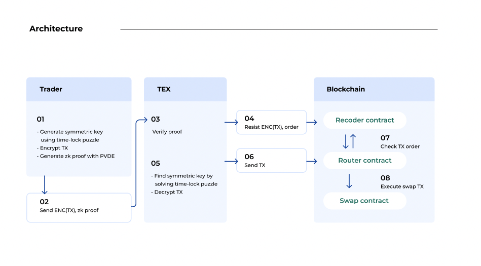

# TEX contracts (originally forked from Uniswap)

TEX: Traders’ Decentralized Exchange

An MEV-resistant DEX for swapping tokens without "hidden" slippages

### Deploy CalHash contract contract & get init code hash(Only onece)

yarn deploy:calHash

- Write the contract address to the "WETH9_CONTRACT_ADDRESS" in .env

yarn calcHah

- It needs to calcuate init code hash for using in "UniswapV2Library.sol"
- Update UniswapV2Library.sol at the line which exists comment as "// init code hash" without "0x"

### Deploy WETH contract

yarn deploy:weth# Depoloy UniswapV2 with UniswapV2Router02

### Deploy CalHash contract contract & get init code hash(Only onece)

yarn deploy:calHash

- Write the contract address to the "WETH9_CONTRACT_ADDRESS" in .env

yarn calcHah

- It needs to calcuate init code hash for using in "UniswapV2Library.sol"
- Update UniswapV2Library.sol at the line which exists comment as "// init code hash" without "0x"

### Deploy WETH contract

yarn deploy:weth

- Write the contract address to the "WETH9_CONTRACT_ADDRESS" in .env

### Deploy UniswapV2Factory contract

yarn deploy:uniswapV2Factory

- Write the contract address to the "FACTORY_CONTRACT_ADDRESS" in .env

### Deploy ERC20 contract (x2)

- Write the contract address to the "ERC20_CONTRACT_ADDRESS" and "ERC20_CONTRACT_ADDRESS2" in .env

### Deploy UniswapV2Router02 contract

yarn deploy:router

- Write the contract address to the "ROUTER_CONTRACT_ADDRESS" in .env

### Add liqudity

yarn router:addLiquidity

- Write the contract address to the "WETH9_CONTRACT_ADDRESS" in .env

### Deploy UniswapV2Factory contract

yarn deploy:uniswapV2Factory

- Write the contract address to the "FACTORY_CONTRACT_ADDRESS" in .env

### Deploy ERC20 contract (x2)

- Write the contract address to the "ERC20_CONTRACT_ADDRESS" and "ERC20_CONTRACT_ADDRESS2" in .env

### Deploy UniswapV2Router02 contract

yarn deploy:router

- Write the contract address to the "ROUTER_CONTRACT_ADDRESS" in .env

### Add liqudity

yarn router:addLiquidity

